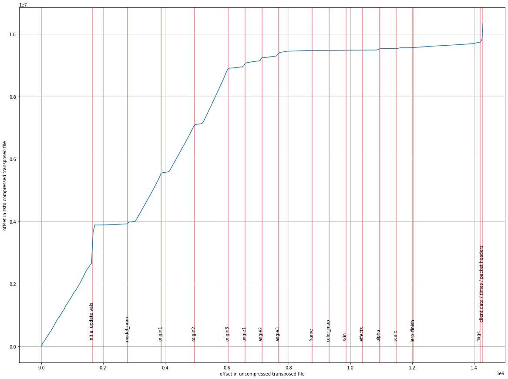

# Quake demo transposer

This is a prototype utility that transforms Quake demo files so that they are
more easily compressible by general purpose compression utilities (eg. gzip,
zstd).  It transposes messages so that messages of the same type are grouped
together in the output file.  Within each group temporal ordering is preserved.
Delta encoding is then applied within each of these groups.

The idea is that arranging the data in this way will give much longer runs of
repeated or zero bytes, and thus be better compressed by LZ77 based algorithms.
In addition, clustering data of the same type together should give more
efficient Huffman encodings.

Transposing data in this way means that more memory is required to decompress,
since we have to read all messages in before we can start writing any fields
out.  To make it more practical, a fixed size internal buffer is used (currently
set to 100MB) which splits the demo data into (mostly) independent blocks.

*Disclaimer*:  This tool isn't finished and fails on certain demos (eg. those
with extraneous data at the end).  It also might not work / compile on your
architecture.

## Compilation

```bash
mkdir build
cd build
cmake ..
```

Note the code makes unaligned pointer accesses and doesn't properly handle
endianness at the moment, so YMMV.

## Usage

Compress:
```bash
./dem_transpose encode < adse_3450.dem | zstd -19 > adse_3450.tp.zstd
```

Decompress:
```bash
./dem_transpose decode < adse_3450.tp.zstd | zstd -d > adse_3450.dem
```

## Results

I applied the tool to every demo on [SDA](https://speeddemosarchive.com/quake/)
(available in a single zip-file in the downloads section).  I am comparing to
the venerable [dzip](https://speeddemosarchive.com/dzip/) format. Dzip uses
delta encoding followed by zlib deflate at default compression levels, but
doesn't do any transposing.

After encoding with the transpose tool, I compress with either zstd at level 19,
or gzip at level 6.  The latter is so that we have a like-for-like comparison
with dzip.

Here's a log-log scatter plot comparing dzip with transpose+gzip:


And here is the same plot but comparing with transpose+zstd:


The total size of the archive under the different compression schemes are:

```
dem_size               44,619.36 MB
dzip_size               2,771.92 MB
transpose_zstd_size     1,704.10 MB
transpose_gz_size       2,200.64 MB
```

Interestingly, Arcane Dimensions demos are compressed much better by the
transposition.  Here are the total sizes grouped by whether the demos are for AD
maps or not:

```
                           not AD            AD
                     ------------  ------------
dem_size             27,545.58 MB  17,073.79 MB
dzip_size             1,830.01 MB     941.96 MB
transpose_zstd_size   1,386.38 MB     317.75 MB
transpose_gz_size     1,765.34 MB     435.27 MB
```

Arcane Dimensions uses a large number of entities for particle-like objects (eg.
bubbles) which results in lots of update messages per frame, but moving in a
predictable way, which could explain the improved ratios.

The full data can be [downloaded as a CSV here](/results/size_comparison.csv).

## Analysis of a single demo

Here's a look at the [biggest demo on SDA](https://www.youtube.com/watch?v=oOrr0gA1T_0):



More specifically, it is a look at the compression ratios attained at various
points within the transposed demo file.  On the x-axis you can see file offset
in the uncompressed data, and on the y-axis you can see the corresponding offset
in the compressed data.  The slope of the line indicates the compression ratio
at a given point.

The initial section (before the first red line) is an index, which contains:
 - Stub messages which just refer to one of the sections of tranposed data.
 - Any message that isn't a packet header, time, update, or client data message.
   These are a small fraction of the total data so aren't encoded.

The jump around "initial update vals" is a section that encodes the initial
values for update message runs (ie. the bits that aren't delta encoded).

`model_num` through to `flags` mark the delta-encoded update message fields.
Each marker denotes the end of the corresponding section, so the data for the
frame field is between the `angle3` and `frame` markers.

The final section denotes the client data, time, and packet header messages.

A few things to note from this view:
- The initial update vals are a short section when uncompressed, but
  nevertheless take up a decent chunk of the compressed file due to being
  relatively uncompressible, compared to the delta encodings.
- Entity origins take up about half of the total compressed file size.  Maybe a
  more clever scheme than delta encoding would help here?  Eg. fit a line /
  curve over the run during encoding, and store the delta from this prediction.

## Conclusions

Transposing helps a bit for non-AD demos, and a lot for AD demos, but at the
cost of more memory during compression / decompression.  Using zstd at the
compression stage also gives a further improvement.  Replacing the zlib
compression stage of dzip with zstd would be interesting and relatively easy to
try.
